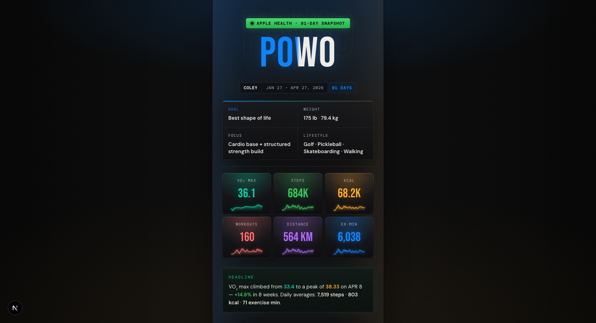
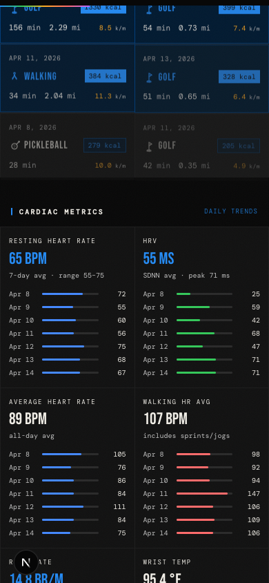
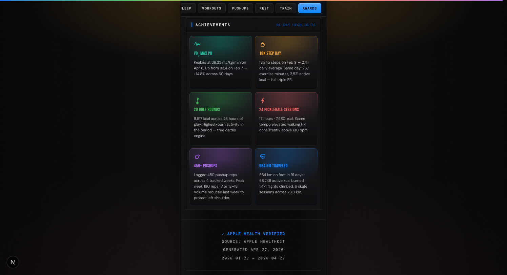

<div align="center">

# POWO — Proof of Workout

**A mobile-first fitness dashboard that turns a week of Apple Health data into a polished, editorial-grade interface.**

Zero UI libraries. Every card, chart, icon, and animation — built from scratch.

[**Live →**](https://proof-of-workout-next.vercel.app)
&nbsp;·&nbsp;
[Tech Stack](#tech-stack)
&nbsp;·&nbsp;
[Design Decisions](#design-decisions)
&nbsp;·&nbsp;
[What This Demonstrates](#what-this-demonstrates)

</div>

<div align="center">





</div>

---

## The Product

POWO ingests a week of Apple HealthKit data for a single athlete and renders it across ten composed sections: a hero KPI grid, weekly totals, a seven-day breakdown table, top workouts by calorie burn, cardiac metrics with per-day sparklines, a VO₂ max trend chart, sleep-stage analysis, a pushup log, awards, and an Apple Health verification footer.

The entire experience is a **430 px-wide, dark-mode column** optimized for a 375 px iPhone viewport. It runs entirely statically — no client-side data fetching, no runtime API.

## Tech Stack

| Layer            | Choice                                           |
| ---------------- | ------------------------------------------------ |
| Framework        | **Next.js 16** (App Router, static generation)   |
| Language         | **TypeScript**, strict types end-to-end          |
| Styling          | **Tailwind CSS v4** via `@theme` design tokens   |
| Animation        | **Framer Motion** — scroll-triggered reveals     |
| Icons            | **Custom monoline SVG system** — no icon library |
| Charts           | **Hand-rolled SVG** — no charting library        |
| Deployment       | **Vercel** — push-to-`main` auto-deploy         |
| CI               | **GitHub Actions** — lint, typecheck, build      |

## Design Decisions

**No UI library.** Every surface — Hero, DailyTable, CardiacMetrics, VO2Chart, SleepAnalysis — is written in plain React with inline styles driven by CSS custom-property tokens. The goal was to prove a coherent design system can be built without pulling in shadcn, Radix, or Chakra.

**No charting library.** The VO₂ trend is a polyline over a gradient-filled path. Cardiac sparklines are flex rows of bars with percentage widths. Sleep stages are stacked rectangles in a single SVG. All under 40 lines each.

**Custom SVG icon system.** Sixteen icons (`IconWalking`, `IconDumbbell`, `IconHeartPulse`, …) each a 20×20 viewBox, `stroke="currentColor"`, `strokeWidth=1.5`. A factory `base()` function enforces accessibility defaults: `role="img"` + `aria-label` when labeled, `aria-hidden` when decorative.

**iMessage-blue accent with strategic variety.** The base accent is `#248bf5`. Each KPI, cardiac metric, and award gets its own accent from a six-color palette (blue, green, coral, amber, purple, teal) so the page reads as colorful without losing its primary identity.

**Mobile-first, capped at 430 px.** Every component is laid out for a 375 px viewport. No breakpoints — the design intentionally lives on the phone.

**Static data, real data.** `lib/data.ts` is a typed export of a real Apple Health week. No API, no database, no client fetch. Fast by construction.

## Features

- **10 composed sections** — Hero, Weekly Summary, Daily Breakdown, Top Workouts, Cardiac, VO₂ Trend, Sleep, Pushups, Awards, Footer
- **Per-metric color coding** — every KPI and card has an intentional accent
- **Activity-aware workout log** — top 6 sorted by calorie burn, each with its SVG icon
- **Seven-day horizontal-scroll daily table** — fits 7 columns at 375 px without clipping
- **Null-safe cardiac sparklines** — days missing wrist-temp data render cleanly
- **Apple Health verified badge** — every data point traceable to HealthKit
- **Dynamic OG image** — generated at build via `next/og` for link previews
- **Custom 404 and error boundary** — on-brand, recoverable
- **Dark theme locked in at the chrome level** — `themeColor` matches `body` background

## What This Demonstrates

- **Component architecture without a framework.** Eleven components, clear single responsibilities, all typed.
- **Data visualization from primitives.** Polylines, paths, masks, `foreignObject`-free SVG charts.
- **Design-system thinking.** Tokens, spacing scale, typography (Bebas Neue / DM Sans / DM Mono), consistent grid math.
- **Accessibility.** Semantic HTML, ARIA on every icon, structured table markup, prefers-reduced-motion friendly.
- **Performance.** Fully static, font preconnect, no runtime JS for data, no icon library bundle.
- **Shipping discipline.** MIT license, CI on PR, error boundaries, custom not-found, OG image, rich metadata.

## Local Development

```bash
git clone https://github.com/coleyrockin/POWO.git
cd POWO
npm install
npm run dev
```

Open [http://localhost:3000](http://localhost:3000).

### Scripts

| Command           | Effect                                    |
| ----------------- | ----------------------------------------- |
| `npm run dev`     | Start Next dev server                     |
| `npm run build`   | Production build (static)                 |
| `npm run start`   | Serve production build                    |
| `npm run lint`    | ESLint (Next.js config)                   |
| `npx tsc --noEmit`| Typecheck without emitting files          |

## Project Structure

```
app/
  layout.tsx              Root layout, fonts, metadata, viewport
  page.tsx                Composition of all ten sections
  globals.css             Design tokens + base styles
  opengraph-image.tsx     Dynamic OG image (next/og)
  twitter-image.tsx       Re-export of OG for Twitter cards
  error.tsx               Error boundary
  not-found.tsx           Custom 404

components/               Eleven React components, one per section
  Hero.tsx
  WeeklySummary.tsx
  DailyTable.tsx
  WorkoutLog.tsx
  CardiacMetrics.tsx
  VO2Chart.tsx
  SleepAnalysis.tsx
  PushupLog.tsx
  Awards.tsx
  Footer.tsx
  SectionHeader.tsx

lib/
  types.ts                Typed data model
  data.ts                 The week's Apple Health export
  icons.tsx               Sixteen SVG icon components + maps

.github/workflows/ci.yml  Lint, typecheck, build on PR
```

## License

MIT © Coley Roberts
