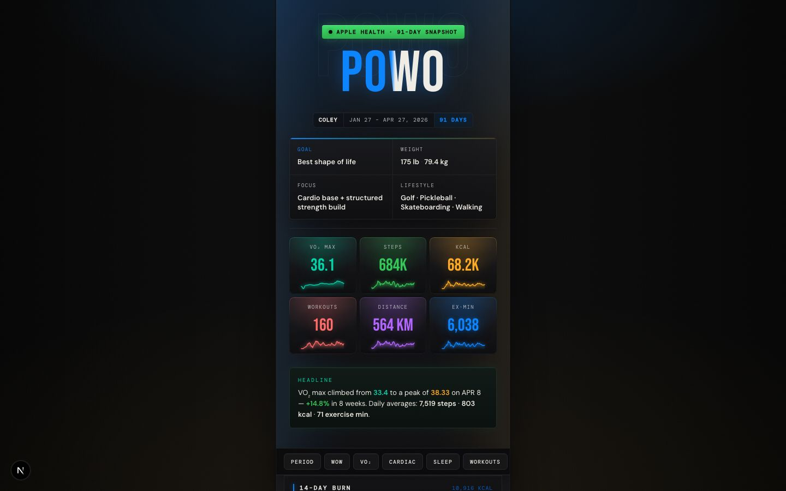

<div align="center">

# POWO — Proof of Workout

**A mobile-first fitness dashboard that turns 91 days of Apple Health data into a cinematic, editorial-grade interface.**

Zero UI libraries. Every card, chart, animation, and visualization — built from scratch.

[**Live →**](https://proof-of-workout-next.vercel.app)
&nbsp;·&nbsp;
[Tech Stack](#tech-stack)
&nbsp;·&nbsp;
[Design Decisions](#design-decisions)
&nbsp;·&nbsp;
[What This Demonstrates](#what-this-demonstrates)

</div>

<div align="center">



</div>

---

## The Product

POWO ingests 91 days of Apple HealthKit data for a single athlete and renders it across fifteen composed sections: a hero KPI grid with per-metric sparklines, a 14-day calorie burn chart, period totals, week-over-week deltas, a daily breakdown table, a VO₂ max trajectory chart, cardiac metrics, sleep-stage analysis, a workout library, a pushup log, rest and training recommendations, achievements, and an Apple Health verification footer.

The entire experience is a **430 px-wide, dark-mode column** optimized for a 375 px iPhone viewport. It runs entirely statically — no client-side data fetching, no runtime API.

## Tech Stack

| Layer            | Choice                                           |
| ---------------- | ------------------------------------------------ |
| Framework        | **Next.js 16** (App Router, static generation)   |
| Language         | **TypeScript**, strict types end-to-end          |
| Styling          | **Tailwind CSS v4** via `@theme` design tokens   |
| Animation        | **Framer Motion** — scroll-triggered reveals, path draw-ons, motion.path |
| Icons            | **Custom monoline SVG system** — no icon library |
| Charts           | **Hand-rolled SVG** — no charting library        |
| Deployment       | **Vercel** — push-to-`main` auto-deploy         |
| CI               | **GitHub Actions** — lint, typecheck, build      |

## Design Decisions

**No UI library.** Every surface is written in plain React with inline styles driven by CSS custom-property tokens. `globals.css` defines the full design system: colors, shadows, motion utilities, glow helpers, and registered `@property` animations. No shadcn, no Radix, no Chakra.

**No charting library.** The VO₂ trajectory uses `motion.path` with `pathLength` for a draw-on reveal, a unified horizontal "story gradient" fill (teal → amber → coral), and a vertical light beam pinned at the personal record. Cardiac sparklines are hand-rolled SVG polylines. Sleep stages are stacked `rect` elements. All chart components are under 220 lines each.

**Custom SVG icon system.** Sixteen icons (`IconWalking`, `IconDumbbell`, `IconHeartPulse`, …) each a 20×20 viewBox, `stroke="currentColor"`, `strokeWidth=1.5`. A factory `base()` function enforces accessibility defaults: `role="img"` + `aria-label` when labeled, `aria-hidden` when decorative.

**Cinematic visual language.** Six registered `@property` CSS animations drive the design system:
- `--ambient-tint` — the full-page backdrop glow transitions color in 900ms as the user scrolls between sections
- `--shine-x` — a radial sheen sweeps across the POWO wordmark every 7s
- `.powo-trophy` — each KPI tile carries a per-accent radial halo and gradient accent border
- `.powo-comet` — every progress bar has a bright leading-edge gradient that fades to white at the tip
- `motion.path pathLength` — VO₂ lines draw themselves on scroll entry
- Animated area fill with `opacity` reveal on the VO₂ chart

**Six-color accent palette with tinting.** Base blue `#0a84ff`, extended with green, coral, amber, purple, and teal. Each KPI, cardiac metric, award, and WoW tile is mapped to one accent and tinted throughout: sparkline fill, radial halo, gradient border, text glow.

**Mobile-first, capped at 430 px.** No breakpoints — the design intentionally lives on the phone.

**Static data, real data.** `lib/data.ts` is a typed export of a real 91-day Apple Health snapshot. No API, no database, no client fetch. Fast by construction.

## Features

- **15 composed sections** — Hero, 14-Day Burn, Period Summary, WoW Delta, Daily Breakdown, VO₂ Trajectory, Cardiac Metrics, Sleep Analysis, Workout Library, Top Sessions, Pushup Log, Rest Recommendation, Training Plan, Achievements, Footer
- **Stat trophy tiles** — hero KPIs each get a sparkline, radial halo, gradient accent border, and count-up animation
- **VO₂ story gradient** — single horizontal fill transitions green (rise) → amber (peak) → coral (decline), with animated draw-on lines and a pulsing PR dot
- **Ambient backdrop tinting** — the page background glow reacts to whichever section is in view, animating via `@property --ambient-tint`
- **Comet-tipped bars** — every progress bar in the app (workout types, weekly heatmap, pushup log, daily step bars) uses a white-tipped gradient with glow
- **POWO wordmark shimmer** — animated `@property --shine-x` radial sheen sweeps across the blue/white text split
- **Scroll-triggered sparklines** — `Sparkline.tsx` draws animated paths on viewport entry across 6 KPI tiles and all 6 cardiac metric cards
- **Activity-aware workout log** — top 6 sessions sorted by calorie burn, each with its SVG icon and per-activity color
- **14-day daily breakdown table** — comet step bars, per-row color highlights for leaders
- **Null-safe cardiac sparklines** — days missing wrist-data render cleanly
- **Week-over-week delta tiles** — 5 per-metric cards with trophy treatment and directional color coding
- **Apple Health verified badge** — live pulse dot, every data point traceable to HealthKit
- **Dynamic OG image** — generated at build via `next/og` for link previews
- **Custom 404 and error boundary** — on-brand, recoverable
- **prefers-reduced-motion respected** — all CSS keyframes and Framer Motion transitions guarded

## What This Demonstrates

- **Component architecture without a framework.** 17 components, clear single responsibilities, all typed.
- **Data visualization from primitives.** Polylines, paths, gradients, `motion.path`, stacked rects — zero chart libraries.
- **Design-system thinking.** CSS `@property` registered animations, six-color accent palette, typography stack (Bebas Neue / DM Sans / DM Mono), consistent spacing.
- **Accessibility.** Semantic HTML, ARIA on every icon, structured table markup, `prefers-reduced-motion` guards on every animation.
- **Performance.** Fully static, font preconnect, no runtime JS for data, no icon library bundle.
- **Shipping discipline.** MIT license, CI on PR, error boundaries, custom not-found, OG image, rich metadata.

## Local Development

```bash
git clone https://github.com/coleyrockin/POWO.git
cd POWO
npm install
npm run dev
```

Open [http://localhost:3000](http://localhost:3000).

### Scripts

| Command           | Effect                                    |
| ----------------- | ----------------------------------------- |
| `npm run dev`     | Start Next dev server                     |
| `npm run build`   | Production build (static)                 |
| `npm run start`   | Serve production build                    |
| `npm run lint`    | ESLint (Next.js config)                   |
| `npx tsc --noEmit`| Typecheck without emitting files          |

## Project Structure

```
app/
  layout.tsx              Root layout, fonts, metadata, viewport
  page.tsx                Composition of all fifteen sections
  globals.css             Design system — tokens, @property animations, utilities
  opengraph-image.tsx     Dynamic OG image (next/og)
  twitter-image.tsx       Re-export of OG for Twitter cards
  error.tsx               Error boundary
  not-found.tsx           Custom 404

components/
  Hero.tsx                Header KPIs, trophy tiles, wordmark shimmer
  ActivityRings.tsx       14-day calorie burn bar chart
  WeeklySummary.tsx       Period totals + heatmap
  WeekChange.tsx          Week-over-week delta tiles
  DailyTable.tsx          14-day daily breakdown table
  VO2Chart.tsx            91-day VO₂ trajectory (SVG, Framer Motion)
  CardiacMetrics.tsx      RHR, HRV, walking HR sparklines
  SleepAnalysis.tsx       Sleep stage stacked bars
  WorkoutLog.tsx          Activity breakdown + top sessions
  PushupLog.tsx           Weekly pushup volume log
  RestRecommendation.tsx  AI-driven recovery protocol
  WorkoutRecommendation.tsx  7-day training plan
  Awards.tsx              Achievement highlight cards
  Footer.tsx              Apple Health verification + wordmark
  Sparkline.tsx           Reusable animated sparkline (SVG + Framer Motion)
  SectionHeader.tsx       Labelled section divider with accent tick
  SectionNav.tsx          Sticky scroll-linked section navigation
  ScrollProgress.tsx      Rainbow scroll progress bar
  CountUp.tsx             Viewport-triggered count-up animation

lib/
  types.ts                Typed data model (91-day schema v2)
  data.ts                 91-day Apple Health export (real data)
  helpers.ts              Stat helpers, recovery engine, weekly aggregates
  icons.tsx               16 SVG icon components + activity color maps

.github/workflows/ci.yml  Lint, typecheck, build on PR
```

## License

MIT © Coley Roberts
